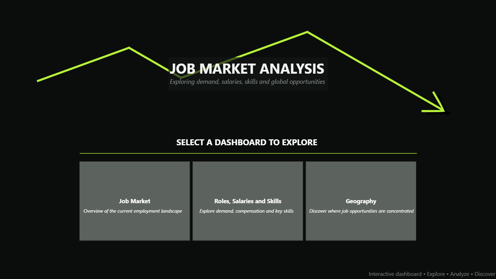
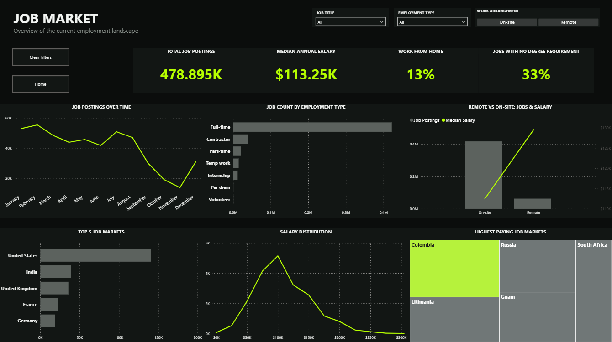
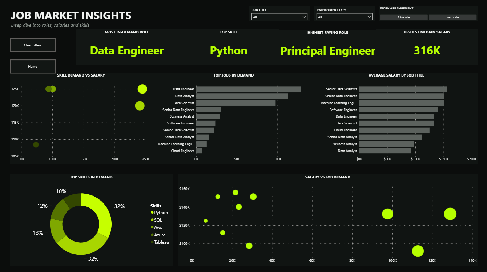
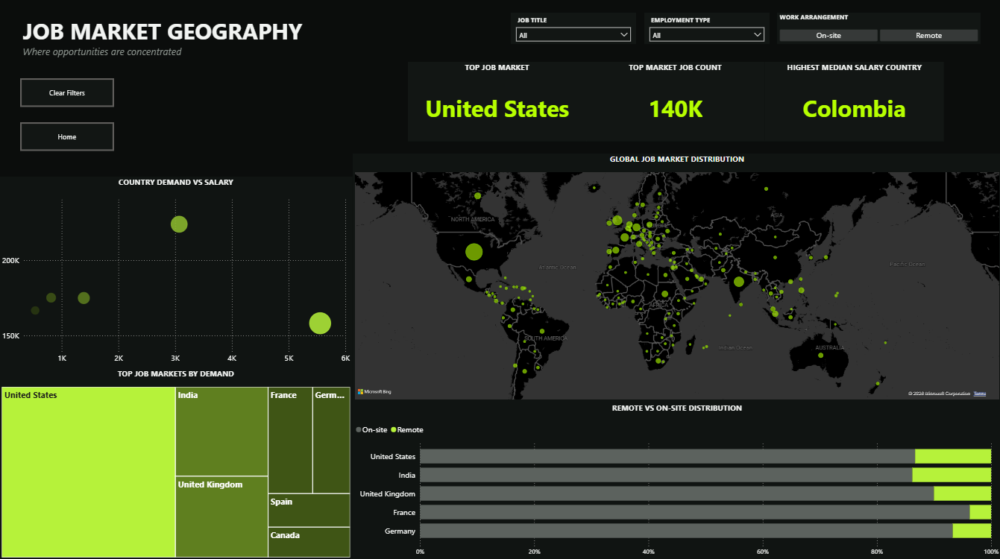

# 📊 Job Market Analysis

> An interactive Power BI dashboard exploring job market trends, salaries, skills, employment types and global opportunities.

---

## 📌 Project Overview

This project analyzes the global job market through an interactive Power BI dashboard.

The goal was to transform raw job posting data into a clear and interactive reporting experience that helps explore:

- 📈 Job market trends over time
- 💼 Employment types and work arrangements
- 💰 Salary distribution and compensation patterns
- 🧠 In-demand roles and skills
- 🌍 Global job market distribution
- 🏠 Remote vs. on-site opportunities

The report is structured into three analytical areas: **Job Market**, **Roles, Salaries and Skills**, and **Geography**.

---

# 🖥️ Dashboard Preview

## 🏠 Home

The landing page provides navigation to the three main areas of the dashboard.



---

## 📊 Job Market

An overview of the current employment landscape, including job posting trends, employment types, salary distribution and the highest-paying markets.



### Key metrics

- Total job postings
- Median annual salary
- Work-from-home share
- Jobs with no degree requirement

### Analysis includes

- Job postings over time
- Job count by employment type
- Remote vs. on-site jobs and salary comparison
- Top job markets
- Salary distribution
- Highest-paying job markets

---

## 🧠 Roles, Salaries and Skills

A deeper look into the relationship between job demand, salaries and the skills required across different roles.



### Analysis includes

- Most in-demand role
- Top skill
- Highest-paying role
- Highest median salary
- Skill demand vs. salary
- Top jobs by demand
- Average salary by job title
- Most in-demand skills
- Salary vs. job demand

---

## 🌍 Geography

A global view of job opportunities, demand and remote work distribution.



### Analysis includes

- Top job market
- Country with the highest job count
- Country with the highest median salary
- Global job market distribution
- Country demand vs. salary
- Top job markets by demand
- Remote vs. on-site distribution by country

---

# 🔍 Interactivity

The dashboard includes interactive filters that allow users to explore the data based on:

- **Job Title**
- **Employment Type**
- **Work Arrangement**
  - On-site
  - Remote

Users can also navigate between dashboard sections and reset the applied filters when needed.

---

# 🛠️ Tools & Skills

This project was built using:

| Tool | Purpose |
|---|---|
| 📊 **Power BI** | Dashboard development and data visualization |
| 🧮 **DAX** | Measures and calculations |
| 🔄 **Power Query** | Data transformation and preparation |
| 📈 **Data Visualization** | Interactive charts and analytical reporting |
| 🗺️ **Geospatial Analysis** | Global job market visualization |

---

# 📊 Key Insights

The analysis highlights several patterns across the job market, including:

- The **United States** represents the largest job market in the dataset.
- **Data Engineer** is identified as the most in-demand role.
- **Python** appears as the most in-demand skill.
- Salary levels vary significantly depending on job role, market and work arrangement.
- Remote opportunities represent a smaller share of total postings compared with on-site positions.
- Job demand and salary do not always follow the same pattern, highlighting differences between highly demanded and highly compensated roles.

---

# 🎯 Project Objectives

The main objectives of this project were to:

- Transform job market data into meaningful insights
- Practice data modeling and analytical thinking
- Build interactive Power BI dashboards
- Develop and use DAX measures
- Present complex information in a clear and visually structured way
- Create a portfolio-ready business intelligence project

---

# 📂 Dashboard Structure

```text
Job Market Analysis
│
├── 🏠 Home
│
├── 📊 Job Market
│   ├── Job Posting Trends
│   ├── Employment Types
│   ├── Salary Distribution
│   └── Top Job Markets
│
├── 🧠 Roles, Salaries and Skills
│   ├── In-Demand Roles
│   ├── In-Demand Skills
│   ├── Salary Analysis
│   └── Demand vs. Compensation
│
└── 🌍 Geography
    ├── Global Job Distribution
    ├── Country Demand
    ├── Salary by Country
    └── Remote vs. On-site Distribution
```

---

# 📚 Data Source & Learning

This project was developed as a hands-on Power BI learning and portfolio exercise using job market data and learning resources provided by **Luke Barousse**.

The project was recreated and adapted as part of my learning process, with a focus on understanding and applying:

- Power BI dashboard development
- Data transformation with Power Query
- DAX measures and calculations
- Data visualization principles
- Analytical thinking and dashboard design

I completed Power BI learning content created by Luke Barousse, and used his educational resources and job market dataset as a foundation for developing this project.

🔗 🔗 **Luke Barousse:** [YouTube Channel](https://www.youtube.com/@LukeBarousse)
